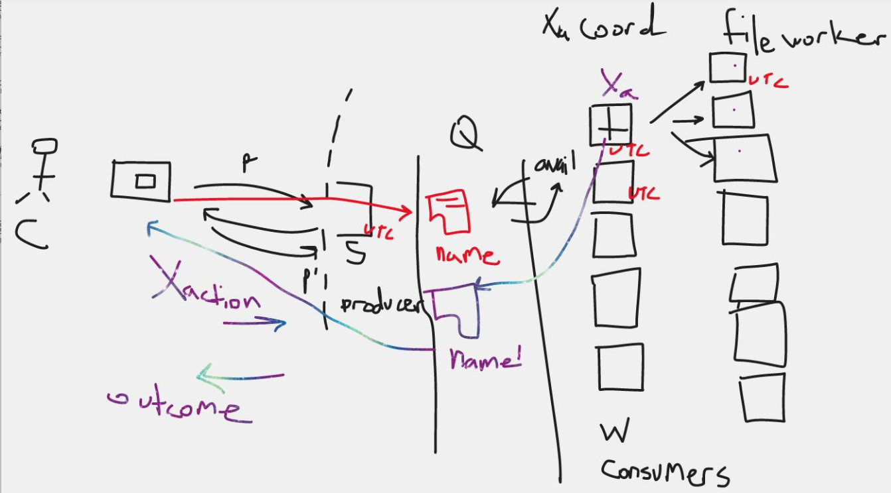

# Design of Distributed Histogram Equalization

## Solution Architecture

## General Protocol

1. Client connects to published IP address and port of the Server (frontends the service)
2. Client will upload the (large) image file
3. Service will store the file and register in the naming service (name + location) -- first pass; store in OS file system
4. Service put in the queue the file name and location (producer queue)
5. Coordinator nodes monitor the queue, and choose what's next from the queue (name + location)
6. Coordinator node downloads the file from the Service (Server)
7. Coordinator node for the first implementation pass, this node will perform the histogram equalization (you can run multithreading). For future implementation passes, we will create another consumer level that this coordinator node is the producer that splits up the file into n segments then passes each segment to a unique worker node with the average intensity. Then coordinator node receives the results from the worker nodes and stitches the final image together.
8. When the coordinator node finishes the histogram equalization then it uploads the file back to the Service (server) listening in on the completed socket.
9. The Service (server) puts the completed file with new name (original name + tag "EQUALIZED") into a queue, and the server on a separate thread sends the file back to the client, if still connected.

### Design constraints

1. How long does this transaction take? If longer than the time it takes for a socket to timeout, then you'll need to send keep-alives on the socket to the client
2. DevOps starts up the Service (Server) and a set number of coordinator nodes, registering in the Service (Server) the names/identities/IPaddr of these coordinator nodes with the Server.
3. Each of the coordinator nodes sends a heartbeat to the Service (Server)
4. The Service (as first pass implemented by Server) will need to publish/inform the other Servers (in the future) of the received files and where they are stored if there is a file/object service OR the Server just replicates to the other Servers on a back channel.

## Scalability

Server frontends the service
